# Hi, I’m Mohammad

Applied AI Scientist at **Verily**, developing a next-generation agentic framework for healthcare.

Graduate student in **Computer Science at the University of Waterloo’s HCI lab**.

**Research interests:** Applied AI · Information Visualization · Human–Computer Interaction

### GitHub activity

<picture>
  <source media="(prefers-color-scheme: dark)" srcset="./profile/stats-dark.svg">
  <source media="(prefers-color-scheme: light)" srcset="./profile/stats-light.svg">
  
</picture>
