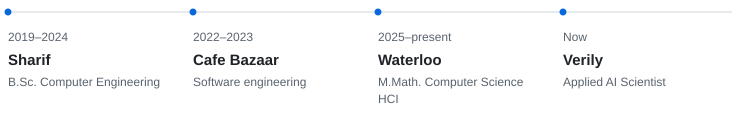
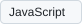
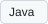
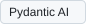

# Hi, I’m Mohammad 👋

I’m an **Applied AI Scientist at Verily**, where I’m developing a next-generation agentic framework for healthcare. I’m also pursuing my **M.Math. in Computer Science at the University of Waterloo**, working in the CS HCI lab.

I combine interdisciplinary research and industry experience to **lead, design, and build AI systems**, from prototypes to production. I work across agent harnesses, RAG, and ML frameworks, adapting tools and methods to the problem.

## A few things I’ve worked on

### [InsightToast](https://github.com/ubixgroup/InsightToast) · UIST ’26

I worked on a meeting companion that brings relevant information and glanceable charts into the conversation through unobtrusive, source-grounded insights.

[Code](https://github.com/ubixgroup/InsightToast) · [Demo](https://insighttoast.vercel.app/) · [Paper](https://doi.org/10.1145/3830398.3830522)

### [AInsight](https://github.com/ubixgroup/AInsight) · CUI ’25

I led the development of a research prototype that generates insights from doctor–patient conversations, grounded in historical data.

[Code](https://github.com/ubixgroup/AInsight) · [Paper](https://doi.org/10.1145/3719160.3737633)

### [DistilKaggle](https://github.com/ISE-Research/DistilKaggle) · MSR ’24

I helped create a dataset of Kaggle notebooks and code metrics to make computational notebooks easier to study at scale.

[Code](https://github.com/ISE-Research/DistilKaggle) · [Dataset](https://doi.org/10.5281/zenodo.10317389) · [Paper](https://doi.org/10.1145/3643991.3644882)

## A little more about me

<picture>
  <source media="(max-width: 600px) and (prefers-color-scheme: dark)" srcset="./profile/timeline-mobile-dark.svg">
  <source media="(max-width: 600px)" srcset="./profile/timeline-mobile-light.svg">
  <source media="(prefers-color-scheme: dark)" srcset="./profile/timeline-dark.svg">
  
</picture>

Before Waterloo, I worked on backend services and an in-app payment platform at Cafe Bazaar. I’ve also been a teaching assistant at Sharif and Waterloo, and mentored undergraduate students exploring HCI and AI.

**Tools I’ve worked with**

Languages

<!-- TOOLS:languages -->

<picture><source media="(prefers-color-scheme: dark)" srcset="./profile/tools/python-dark.svg"></picture>
<picture><source media="(prefers-color-scheme: dark)" srcset="./profile/tools/sql-dark.svg"></picture>
<picture><source media="(prefers-color-scheme: dark)" srcset="./profile/tools/javascript-dark.svg"></picture>
<picture><source media="(prefers-color-scheme: dark)" srcset="./profile/tools/java-dark.svg"></picture>
<picture><source media="(prefers-color-scheme: dark)" srcset="./profile/tools/dart-dark.svg"></picture>

<!-- /TOOLS:languages -->

AI & agents

<!-- TOOLS:ai -->

<picture><source media="(prefers-color-scheme: dark)" srcset="./profile/tools/pytorch-dark.svg"></picture>
<picture><source media="(prefers-color-scheme: dark)" srcset="./profile/tools/tensorflow-dark.svg"></picture>
<picture><source media="(prefers-color-scheme: dark)" srcset="./profile/tools/hugging-face-dark.svg"></picture>
<picture><source media="(prefers-color-scheme: dark)" srcset="./profile/tools/langgraph-dark.svg"></picture>
<picture><source media="(prefers-color-scheme: dark)" srcset="./profile/tools/pydantic-ai-dark.svg"></picture>
<picture><source media="(prefers-color-scheme: dark)" srcset="./profile/tools/langchain-dark.svg"></picture>

<!-- /TOOLS:ai -->

Backend & infrastructure

<!-- TOOLS:backend -->

<picture><source media="(prefers-color-scheme: dark)" srcset="./profile/tools/fastapi-dark.svg"></picture>
<picture><source media="(prefers-color-scheme: dark)" srcset="./profile/tools/flask-dark.svg"></picture>
<picture><source media="(prefers-color-scheme: dark)" srcset="./profile/tools/docker-dark.svg"></picture>
<picture><source media="(prefers-color-scheme: dark)" srcset="./profile/tools/gcp-dark.svg"></picture>
<picture><source media="(prefers-color-scheme: dark)" srcset="./profile/tools/git-dark.svg"></picture>

<!-- /TOOLS:backend -->

---

[Google Scholar](https://scholar.google.com/citations?user=jruapycAAAAJ&hl=en) · [LinkedIn](https://www.linkedin.com/in/mohammad-abolnejadian/) · [Email](mailto:mohammad.abolnejadian@uwaterloo.ca)
